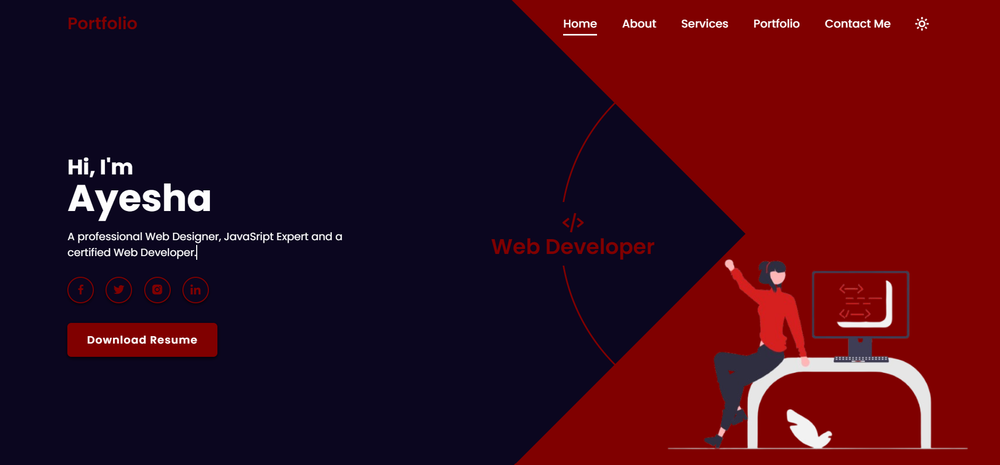
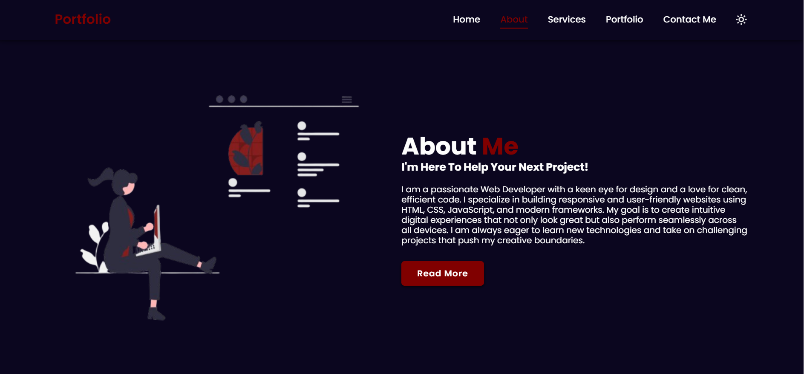
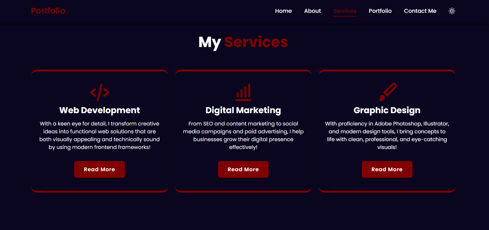
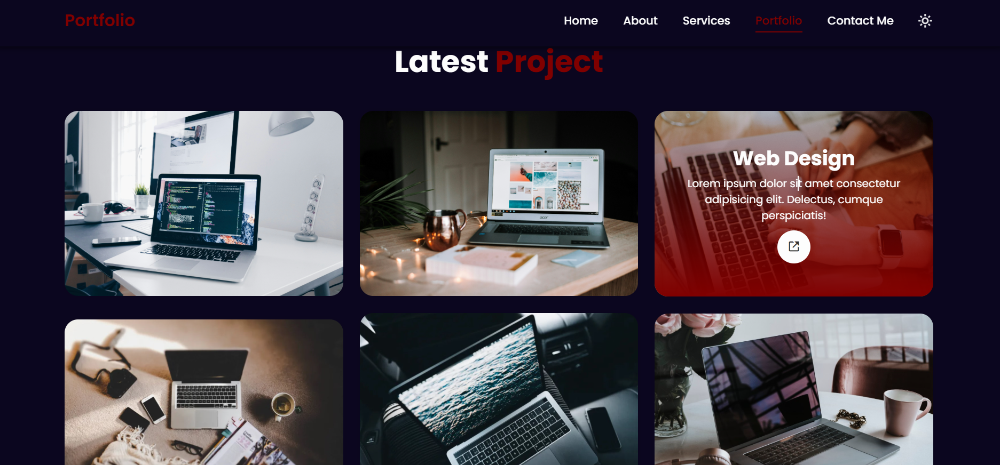
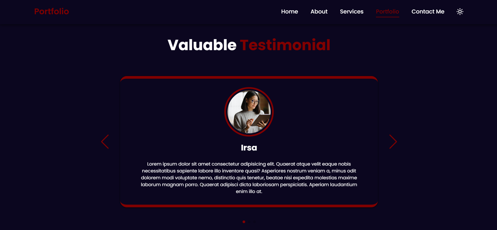

# 🌐 Personal Portfolio Website 

Welcome to my **Personal Portfolio Website** project! 🚀 This is a fully responsive and interactive portfolio website showcasing my skills, projects, and services as a Web Developer, Graphic Designer, and Digital Marketer.

---

## 📋 Features
- ✅ Fully Responsive Design (Mobile & Desktop)
- ✅ Smooth Scroll Animations
- ✅ Light/Dark Mode Toggle
- ✅ Interactive Navigation Bar
- ✅ Services & Project Portfolio Sections
- ✅ Testimonial Slider (Swiper.js)
- ✅ Contact Me Form (frontend only)
- ✅ ScrollReveal Animations
- ✅ Social Media Links & Download Resume
- ✅ Beautiful, Clean UI Design

---
## 📸 Screenshots

### Landing Section:

---

### About Section:

---

### Skills Section:

---

### Projects Section:

---

### Testimonial Section:

---

## 🛠️ Tech Stack
- **HTML5**
- **CSS3**
- **JavaScript (Vanilla JS)**
- **Swiper.js** *(for Testimonials Slider)*
- **ScrollReveal.js** *(for animations)*
- **Boxicons** *(for icons)*

---

## 📂 Folder Structure

/Portfolio-Website/
│
├── index.html
├── style.css
├── script.js
├── /images/
│ ├── Maroon.png
│ ├── maroonn.png
│ ├── testimonial1.jpg
│ └── ... (other images)
└── README.md

---

🏗️ Future Improvements:

-Add backend integration for Contact Form (EmailJS / PHP)

-Add Blog Section

-Project filtering & category tabs

-Deploy on GitHub Pages / Netlify

---

🤝 Connect with Me:

LinkedIn: www.linkedin.com/in/ayesha-tariq21

---

## 👩‍💻 Author

**Ayesha Tariq**

---

